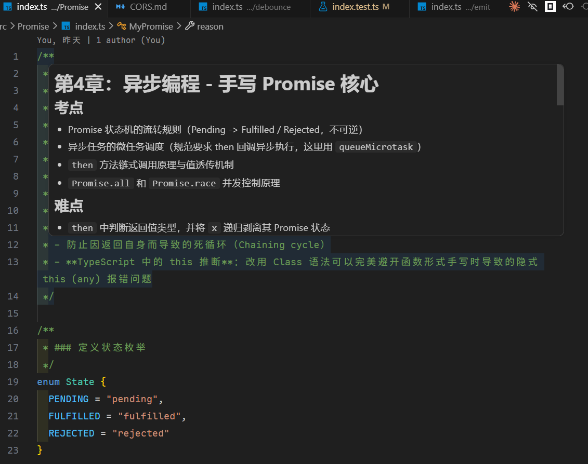

# Comment Markdown Render

A Visual Studio Code extension that renders Markdown content directly within code comments, including support for LaTeX math expressions. It handles most common comment styles across various programming languages, including multi-line block comments and stacked single-line comments.

The original motivation was to be able to code in most languages as in a Jupyter notebook, particularly in Formalization languages (e.g., Lean4) where rendering mathematical formulas is particularly useful.

## Example

As shown below, when hovering over a comment block starting with the `md` prefix, the extension renders the Markdown content.



## How to Use

To trigger the Markdown rendering, simply start your comment with the `md` prefix.

### Multi-line Blocks

The extension supports standard block comments across most languages:

```javascript
/** md
 * # Documentation
 * This is a **JSDoc** comment with math:
 * $$ \frac{-b \pm \sqrt{b^2-4ac}}{2a} $$
 */
```

```python
""" md
# Python Docstring
You can use *Markdown* here too!
- Item 1
- Item 2
"""
```

### Single-line Comments

You can also stack single-line comments:

```javascript
// md # Title
// md This is a list:
// md 1. First point
// md 2. Second point with $\alpha$
```

## Supported Comment Styles

| Syntax | Languages |
|--------|-----------|
| `/* md ... */` or `/** md ... */` | JS, TS, C++, Java, CSS, etc. |
| `""" md ... """` | Python, Julia |
| `''' md ... '''` | Python |
| `/* md ... */` | Go, Rust, PHP, Swift, Kotlin, Scala |
| `// md` | C-style languages |
| `# md` | Python, Ruby, YAML, Bash |
| `-- md` | Lua, Haskell, SQL |
| `/- md ... -/` | Lean4 |
| `<!-- md ... -->` | HTML/XML |

## Features

✅ **Multi-line and single-line comment support** - Works with both block comments and stacked single-line comments

✅ **Multi-language support** - Automatically detects and handles comment formats for different programming languages

✅ **Full Markdown rendering** - Supports complete Markdown syntax including lists, tables, code blocks, and more

✅ **LaTeX math expressions** - Render mathematical formulas using inline ($...$) and display ($$...$$) notation

✅ **Comprehensive test coverage** - Thoroughly tested across all supported languages and comment styles

## Development

For development details, please refer to [DEVELOPMENT.md](./DEVELOPMENT.md).

## Testing

```bash
pnpm test
```

## License

MIT
